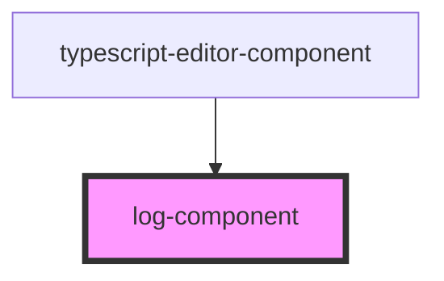

# log-component

<!-- Auto Generated Below -->

## Properties

| Property        | Attribute        | Description | Type      | Default |
| --------------- | ---------------- | ----------- | --------- | ------- |
| `showTimestamp` | `show-timestamp` |             | `boolean` | `true`  |

## Methods

### `clear() => Promise<void>`

#### Returns

Type: `Promise<void>`

## Dependencies

### Used by

 - [typescript-editor-component](../typescript-editor-component)

### Graph

----------------------------------------------

*Built with [StencilJS](https://stenciljs.com/)*
