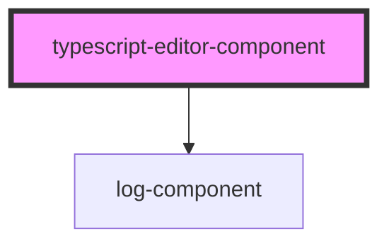

# my-component

<!-- Auto Generated Below -->

## Properties

| Property    | Attribute    | Description | Type     | Default |
| ----------- | ------------ | ----------- | -------- | ------- |
| `baseUrl`   | `base-url`   |             | `string` | `''`    |
| `lineCount` | `line-count` |             | `number` | `10`    |

## Dependencies

### Depends on

- [log-component](../log-component)

### Graph

----------------------------------------------

*Built with [StencilJS](https://stenciljs.com/)*
